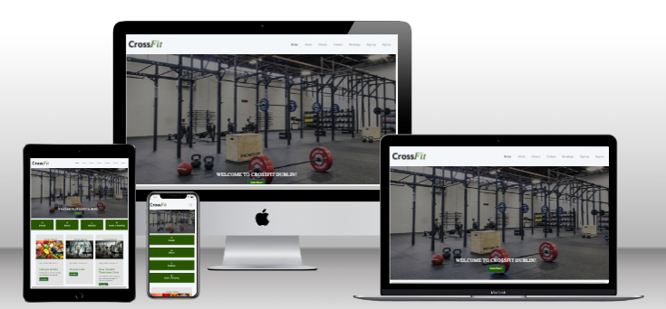

[](https://github.com/ciarangriffin93/CGCrossFit/photography-blog/commits/main)
[](https://github.com/ciarangriffin93/CGCrossFit/commits/main)
[](https://github.com/ciarangriffin93/CGCrossFit)

# CrossFit - A Django project 4 for Code Institute

Welcome CGCrossFit is your go to website for all things CrossFit. Our platform allows users to easily register for an account, book appointments, and stay informed about upcoming events. We are dedicated to helping individuals achieve their health and fitness goals by providing a seamless experience for managing workouts and connecting with the CrossFit community!

Whether you're looking to schedule your next training session, learn about upcoming CrossFit events, or simply explore information to enhance your fitness journey, CGCrossFit is here to support you every step of the way. Join us today and take the first step towards a healthier, fitter you!

Link to live website here:
[Click Me](https://crossfit-pp4-85463579609b.herokuapp.com/)



## Table of Contents

- [Project Goals](#project-goals-and-planning)
- [UX](#ux)
  - [Agile](#agile-methodology)
  - [User Stories](#user-stories)
  - [Epic: Staff](#epic-staff---crossfit-class)
  - [Epic: User](#epic-site-access---user-authentication)
- [Wireframes](#wireframes)
  - [Desktop](#desktop)
  - [Ipad](#ipad)
  - [Mobile](#mobile)
- [Database Diagram](#database-diagram)
- [General Features](#general-features)
- [Colour](#colours)
  - [Color Scheme](#color-scheme)
- [Typography](#typography)
- [Features](#features)
  - [Header and Nav](#header-and-nav)
  - [Home Page](#home-page)
  - [About Page](#about-page)
  - [Classes Page](#classes-page)
  - [Contact Page](#contact-page)
  - [Booking Page](#booking-page)
  - [Add Class Page](#add-class-page-staff-member-only)
- [Future Features](#future-features)
  - [Email Registration](#email-registration)
  - [Cancellation Window](#cancellation-window)
  - [Admin Page Enhancements](#admin-page-enhancements)
- [Testing](#testing)
  - [Code Validation](#code-validation)
  - [HTML](#html)
  - [CSS](#css)
  - [Lighthouse](#lighthouse)
  - [Desktop](#desktop)
  - [Mobile](#mobile)
  - [JAVASCRIPT](#javascript)
  - [Python](#python)
- [Technologies used](#technologies-used)
  - [Languages Used](#languages-used)
  - [Django Packages](#django-packages)
  - [Frameworks](#frameworks)
- [Deployment](#deployment)
  - [PostgreSQL Database](#postgresql-database)
  - [Cloudinary API](#cloudinary-api)
  - [Heroku Deployment](#heroku-deployment)
  - [Local Deployment](#local-deployment)
  - [Cloning](#cloning)
  - [Forking](#forking)
- [Credits](#credits)
  - [content](#content)
- [Acknowledgements](#acknowledgements)


  


## Project Goals and Planning

This site was developed using:

* Create a website using Django.

* Using Bootstrap, HTML, CSS, python and javascript.

* Create a website with CRUD functionality.

## UX

#### Agile Methodology

This project was developed using the Agile methodology. The implementation progress of all epics and user stories was tracked through a GitHub Project can be found. [here](https://github.com/users/ciarangriffin93/projects/21/views/1)


#### User Stories

The goal of this website is to make CrossFit booking easy. Users just need to log in, which will take them to a page where they can book CrossFit sessions.

Users also have the ability to edit and delete their reservations while logged in. The website is designed to be easy to navigate, and it clearly shows available booking slots.

|   EPIC                                | |                                User Story                                                    |
| :-------------------------------------|--|:------------------------------------------------------------------------------------------- |
|**ADMINISTRATION**                     |  ||
|                                       || As a logged-in admin, I want to access the admin page.|
|                                       || As a logged-in admin, I want to authenticate and manage comments.|
|                                       || As a logged-in admin, I want to create new users and authors.|
|                                       || As a logged-in admin, I want to delete users, booking authors, and comments.|
|**CONTENT**                            |  ||
|                                       || As a user, I want to see a menu so I can easily navigate through website content |             
|                                       || As a user, I want to understand what the website is about without having to read too much.|
|**USER REGISTRATION**                  |  || 
|                                       || As a user, I want to register on the website.|
|                                       || As a user, I want to authenticate using only my email and password.|
|                                       || As a user, I want to know that I've logged out successfully.|
|**BLOGS EVENT**                        |  ||
|                                       || As a logged-in user, I want to select a blog and comment on or like the selected blog.|
|                                       || As a logged-in user, I want to delete and edit my own previous comments.|
|**BOOKING**                            |  ||
|                                       || As a user, I want to book an appointment.|
|                                       || As a logged-in user, I want to cancel a booking.|
|**CONTACT**                            |  ||
|                                       || As a user, I want to contact the admin.|
|                                       || As a user, I want to receive confirmation that my message has been received.|
|                                       || As a user, I want to see contact information on the website.|

### Epic: Staff - CrossFit Class

* As a site staff member, I can manage CrossFit classes (create, read, update, and delete) so that users can view and participate in upcoming CrossFit session

<h4>AC1: Create New CrossFit Class</h4>
* Given I am a site staff member,
* When I navigate to the 'Add Class' form on the admin panel,
* Then I should be able to fill out the form with the following details:
Class Name 
Date and Time 
Duration 
Instructor Name 
Maximum Participants 
Description 
* I can submit the form,
* Then the new CrossFit class should be created and saved in the system,
* I should see a confirmation message (e.g., "CrossFit class successfully created").

<h4>AC2: Read/View CrossFit Classes</h4>
* Given a CrossFit class has been created,
* When I visit the homepage or classes section,
*Then I should see a list of upcoming CrossFit classes with details such as:
Class Name
Date and Time
Instructor Name
Available Slots
Users should be able to view these classes in a calendar view or list format.

<h4>AC3: Update/Edit CrossFit Class</h4>
* Given I am a site staff member,
* I have created a CrossFit class,
* When I navigate to the admin panel and select the class I want to edit,
* I should be able to update any of the class details (e.g., time, instructor, maximum participants),
* Save the changes,
* the updated details should be reflected in the system,
* I should see a confirmation message (e.g., "CrossFit class successfully updated").

<h4>AC4: Delete CrossFit Class</h4>
* Given I am a site staff member,
* I have created a CrossFit class,
* I navigate to the admin panel and select the class I want to delete,
* I should be able to delete the class,
* I should see a confirmation message (e.g., "CrossFit class successfully deleted"),
* The class should no longer appear on the homepage or in the classes list.

### Epic: Site Access - User Authentication

* As a site user, I can log in with my created username and password to access the site and view my previous actions, including registered CrossFit classes.

<h4>AC1: User Login</h4>
* Given I am a registered site user,
* When I navigate to the login page,
* Then I should see a form that requires my username and password,
* I can enter my credentials and submit the form,
* I should be logged in,
* I should see a welcome message (e.g., "Welcome, [Username]!").
* If the credentials are incorrect:
I should see an error message (e.g., "Invalid username or password. Please try again."),

<h4>AC2: View Registered CrossFit Classes</h4>
* Given I am a logged-in user,
*  I have registered for CrossFit classes in previous sessions,
* When I navigate to my dashboard or profile page,
* I should see a list of all the CrossFit classes I have registered for,
* Including details such as Class Name, Date and Time, Instructor, and Status (e.g., "Registered").
* If I have not registered for any classes:
I should see a message indicating that (e.g., "You have not registered for any CrossFit classes yet."),
I should be provided with a link or option to browse upcoming classes.

<h4>AC3: User Logout</h4>

* Given I am a logged-in user,
* When I click on the "Logout" button or link,
* I should be prompted with a confirmation message (e.g., "Are you sure you want to log out?"),
* If I confirm the logout:
I should be logged out of the system,
I should be redirected to the homepage or a logged-out landing page,
I should see a message confirming the logout (e.g., "You have successfully logged out.").
* If I cancel the logout action:
I should remain logged in and stay on the current page.

## Wireframes

* I used [Balsamiq](https://balsamiq.com/wireframes) to design the wireframes for my website.

#### Desktop:
<details>


</details>


#### Ipad:
<details>


</details>

#### Mobile:
<details>


</details>


## Database Diagram
This project the Django User Model.
The data schema was created using [Lucid](https://lucid.app/ "lucid website homepage").


## General Features

## Colours

#### Color Scheme

* I selected these colors to use on the website. (created with coolers.io)

<br>

## Typography 

## Features

### Header and Nav

<h4>The navigation elements include Home, About, Classes, Contact, and Booking. If the user is signed in, there will also be a link to My Bookings and comment.</h4>


<h4>add_class navigation should only be visible to users with staff status. Staff members should see the add_class option in the navigation, while regular users should not.</h4>


### Home Page

<h4>Welcome to join if you are interested in joining CrossFit. CGCrossfit is a CrossFit gym located in Dublin. Our website is designed to showcase the wide range of services we offer to help you achieve your fitness goals.</4>


<h4>The events are clickable and will render more information about the event.</h4>


<h4>Users have access to events and can also find more information about CrossFit and healthy living.</h4>


<h4>At the bottom of this page, users can read comments from other users. If a user is logged in or, they have access to buttons for deleting or updating comments. And Users can also click the heart icon to like event.</h4>


<h4>Users are allowed to edit their own post comments.</h4>


<h4>Users are allowed to delete their own post comments.</h4>


### About Page

<h4>Users can read information about CrossFit.</h4>


### Classes Page

<h4>Users can view the class timetable.</h4>


### Contact Page

<h4>The Contact Page allows users to access contact details and send emails using the contact form.</h4>


### Booking Page

<h4>If a user is not signed in, they will be redirected to the registration form. A signed-in user can book a session by selecting a date and time.</h4>


<h4>When a user makes a booking, a message will show that the booking was successful</h4>


<h4>Users can cancel their booking if needed</h4>


<h4>When a user makes a canceled booking, a message will show that the booking cancelled</h4>


### Add Class Page (Staff member only)


<h4>Only staff members can sign in and create a CrossFit class, including setting the time and date.</h4>


<h4>Only staff members can use the "Edit" option to change class details.</h4>


<h4>Only staff members can delete class details</h4>


## Future Features

### Email Registration:

* User Flow: 
Allow users to register an email address when they book a session or through their profile settings.
Notification System: Integrate an email service provider (like SendGrid or Mailgun) to handle email notifications. Ensure that users receive updates for changes or cancellations of their sessions.
Backend Logic: Implement logic to check for changes or cancellations and trigger email notifications accordingly.

### Cancellation Window:

* Cancellation Policy: 
Define a specific time frame (e.g., 24 hours before the session) during which users cannot cancel their bookings.
User Interface: Display this cancellation policy clearly during the booking process and in user account settings.
Enforcement: Implement backend validation to prevent cancellations within the specified window. Consider offering a grace period or exception handling for special cases.

### Admin Page Enhancements:

* Activity and Session Management: 
Develop an admin interface where administrators can view, edit, and manage Activity and Session models.
Permissions: Ensure that only authorized users (e.g., admins) have access to this page and can make changes.
User Experience: Provide a user-friendly interface with search and filter options to easily locate and modify records. Consider adding validation checks to ensure data integrity during updates.

## Testing

### Code Validation

#### HTML

<details>
<summary>home.html</summary>
https://validator.w3.org/nu/?doc=https%3A%2F%2Fcrossfit-pp4-85463579609b.herokuapp.com%2F
</details>

<details>
<summary>about.html</summary>
https://validator.w3.org/nu/?doc=https%3A%2F%2Fcrossfit-pp4-85463579609b.herokuapp.com%2Fabout%2F
</details>

<details>
<summary>classes.html</summary>
https://crossfit-pp4-85463579609b.herokuapp.com/about/classes/
</details>

<details>
<summary>contact.html</summary>
https://validator.w3.org/nu/?doc=https%3A%2F%2Fcrossfit-pp4-85463579609b.herokuapp.com%2Fcontact%2Fcontact%2F
</details>

<details>
<summary>booking.html</summary>
https://validator.w3.org/nu/?doc=https%3A%2F%2Fcrossfit-pp4-85463579609b.herokuapp.com%2Fbooking%2F
</details>

<details>
<summary>add_class</summary>
https://validator.w3.org/nu/?doc=https%3A%2F%2Fcrossfit-pp4-85463579609b.herokuapp.com%2Fbooking%2Fclass%2Fadd%2F
</details>

<details>
<summary>logout.html</summary>
https://validator.w3.org/nu/?doc=https%3A%2F%2Fcrossfit-pp4-85463579609b.herokuapp.com%2Faccounts%2Flogout%2F
</details>

<details>
<summary>signup.html</summary>
https://validator.w3.org/nu/?doc=https%3A%2F%2Fcrossfit-pp4-85463579609b.herokuapp.com%2Faccounts%2Fsignup%2F
</details>

<details>
<summary>login.html</summary>
https://validator.w3.org/nu/?doc=https%3A%2F%2Fcrossfit-pp4-85463579609b.herokuapp.com%2Faccounts%2Flogin%2F
</details>

<details>
<summary>error404.html</summary>
https://validator.w3.org/nu/?doc=https%3A%2F%2Fcrossfit-pp4-85463579609b.herokuapp.com%2F404%2F
</details>

#### CSS
<details>
<summary>Style.css</summary>


</details>

#### Lighthouse

Lighthouse was used to test Performance, Best Practices, Accessibility and SEO on Desktop and Mobile.

### Desktop

<details>
<summary>Home-page</summary>


</details>

<details>
<summary>About-page</summary>


</details>

<details>
<summary>Classes-page</summary>


</details>

<details>
<summary>Contact-page</summary>


</details>

<details>
<summary>Booking-page</summary>


</details>

<details>
<summary>add_class-page</summary>


</details>

### Mobile

<details>
<summary>Home-page</summary>


</details>

<details>
<summary>About-page</summary>


</details>

<details>
<summary>Classes-page</summary>


</details>

<details>
<summary>Contact-page</summary>


</details>

<details>
<summary>Booking-page</summary>


</details>

<details>
<summary>add_class-page</summary>


</details>


#### JAVASCRIPT

<details>
<summary>map.js</summary>


</details>

<details>
<summary>confirmation_script.js</summary>


</details>

#### Python

Python testing was done using the PEP8.<br>All python files were entered into the online checker and no errors were found in any of the custom code.

* About

<details>
<summary>admin.py</summary>


</details>

<details>
<summary>models.py</summary>


</details>

<details>
<summary>views.py</summary>


</details>

* Blog

<details>
<summary>admin.py</summary>


</details>

<details>
<summary>forms.py</summary>


</details>

<details>
<summary>models.py</summary>


</details>

<details>
<summary>views.py</summary>


</details>

* Booking

<details>
<summary>admin.py</summary>


</details>

<details>
<summary>forms.py</summary>


</details>

<details>
<summary>models.py</summary>


</details>

<details>
<summary>views.py</summary>


</details>

* Contact

<details>
<summary>admin.py</summary>


</details>

<details>
<summary>forms.py</summary>


</details>

<details>
<summary>models.py</summary>


</details>

<details>
<summary>views.py</summary>


</details>


## Technologies used

### Languages Used

* [HTML](https://en.wikipedia.org/wiki/HTML/)
* [CSS ](https://en.wikipedia.org/wiki/CSS)
* [JavaScript](https://www.javascript.com/)
* [Python](https://www.djangoproject.com/)
* [Django](https://www.python.org/)
* [Bootstrap](https://getbootstrap.com/)

### Django Packages

* [Psycopg2:](https://pypi.org/project/psycopg2/)<br>
   A library for Python that facilitates interaction with PostgreSQL databases.
* [Gunicorn:](https://gunicorn.org/)<br>
   A server used in Heroku for running Python web applications.
* [Allauth:](https://django-allauth.readthedocs.io/en/latest/installation.html)<br>
   A package for authentication and account management.
* [Cloudinary:](https://cloudinary.com/)<br>
   Used for hosting static files and media.
* [Summernote:](https://summernote.org/)<br>
   A rich text editor.
* [Crispy Forms:](https://django-crispy-forms.readthedocs.io/en/latest/)<br>
   A tool to style forms.

### Frameworks 

* [Bootstrap:](https://getbootstrap.com/)<br>
   Was used to style the website, add responsiveness and interactivity
* [GitHub:](https://github.com/)<br>
   GitHub is used to store the project's code after being pushed from Git
* [Heroku:](https://id.heroku.com)<br>
   Heroku was used to deploy the live project.
* [PostgreSQL:](https://dbs.ci-dbs.net/)<br>
   The database used through heroku.
* [Balsamiq:](https://balsamiq.com/)<br>
   To create all wireframes.
* [Lucidchart:](https://lucid.app/)<br>
   Lucidchart was used to create the database diagram
* [Pexels:](https://www.pexels.com/sv-se/)<br>
   To search for images.
* [W3Schools:](https://www.w3schools.com/)<br>
   To Read the documentation.
* [PEP8:](https://pep8ci.herokuapp.com/)<br>
   Was used to validate all the Python code.
* [Jshint:](https://jshint.com/)<br>
   Was used to validate all the javascript code.
* [W3C HTML:](https://validator.w3.org/)<br>
   Was used to validate all the HTML code
* [W3C CSS:](https://jigsaw.w3.org/css-validator/)<br>
   Was used to validate the CSS code
* [Am I responsive:](https://techsini.com/multi-mockup/index.php)<br>
   For testing wireframes.
* [Fontawesome:](https://fontawesome.com/)<br>
   To add icons to the website
* [Google Tools:](https://developer.chrome.com/docs/devtools/)<br>
   To search for information.
* [Google Fonts:](https://fonts.google.com/)<br>
   To search for and borrow fonts.
* [Coolors:](https://coolors.co/)<br>
   To create a colour chart.
* [Stack Overflow:](https://stackoverflow.com/ )<br>
   For Troubleshooting.

## Deployment

The live deployed application can be found deployed on [Heroku](https://crossfit-pp4-85463579609b.herokuapp.com).

### PostgreSQL Database

This project uses a [Code Institute PostgreSQL Database](https://dbs.ci-dbs.net).

To obtain my own Postgres Database from Code Institute, I followed these steps:

- Signed-in to the CI LMS using my email address.
- An email was sent to me with my new Postgres Database.

> [!CAUTION]  
> - PostgreSQL databases by Code Institute are only available to CI Students.
> - You must acquire your own PostgreSQL database through some other method
> if you plan to clone/fork this repository.
> - Code Institute students are allowed a maximum of 8 databases.
> - Databases are subject to deletion after 18 months.

### Cloudinary API

This project uses the [Cloudinary API](https://cloudinary.com) to store media assets online, due to the fact that Heroku doesn't persist this type of data.

To obtain your own Cloudinary API key, create an account and log in.

- For *Primary interest*, you can choose *Programmable Media for image and video API*.
- Optional: *edit your assigned cloud name to something more memorable*.
- On your Cloudinary Dashboard, you can copy your **API Environment Variable**.
- Be sure to remove the `CLOUDINARY_URL=` as part of the API **value**; this is the **key**.

### Heroku Deployment

This project uses [Heroku](https://www.heroku.com), a platform as a service (PaaS) that enables developers to build, run, and operate applications entirely in the cloud.

Deployment steps are as follows, after account setup:

- Select **New** in the top-right corner of your Heroku Dashboard, and select **Create new app** from the dropdown menu.
- Your app name must be unique, and then choose a region closest to you (EU or USA), and finally, select **Create App**.
- From the new app **Settings**, click **Reveal Config Vars**, and set your environment variables.

> [!IMPORTANT]  
> This is a sample only; you would replace the values with your own if cloning/forking my repository.

| Key | Value |
| --- | --- |
| `CLOUDINARY_URL` | user's own value |
| `DATABASE_URL` | user's own value |
| `DISABLE_COLLECTSTATIC` | 1 (*this is temporary, and can be removed for the final deployment*) |
| `SECRET_KEY` | user's own value |

Heroku needs three additional files in order to deploy properly.

- requirements.txt
- Procfile
- runtime.txt

You can install this project's **requirements** (where applicable) using:

- `pip3 install -r requirements.txt`

If you have your own packages that have been installed, then the requirements file needs updated using:

- `pip3 freeze --local > requirements.txt`

The **Procfile** can be created with the following command:

- `echo web: gunicorn app_name.wsgi > Procfile`
- *replace **app_name** with the name of your primary Django app name; the folder where settings.py is located*

The **runtime.txt** file needs to know which Python version you're using:
1. type: `python3 --version` in the terminal.
2. in the **runtime.txt** file, add your Python version:
	- `python-3.9.19`

For Heroku deployment, follow these steps to connect your own GitHub repository to the newly created app:

Either:

- Select **Automatic Deployment** from the Heroku app.

Or:

- In the Terminal/CLI, connect to Heroku using this command: `heroku login -i`
- Set the remote for Heroku: `heroku git:remote -a app_name` (replace *app_name* with your app name)
- After performing the standard Git `add`, `commit`, and `push` to GitHub, you can now type:
	- `git push heroku main`

The project should now be connected and deployed to Heroku!

### Local Deployment

This project can be cloned or forked in order to make a local copy on your own system.

For either method, you will need to install any applicable packages found within the *requirements.txt* file.

- `pip3 install -r requirements.txt`.

You will need to create a new file called `env.py` at the root-level,
and include the same environment variables listed above from the Heroku deployment steps.

> [!IMPORTANT]  
> This is a sample only; you would replace the values with your own if cloning/forking my repository.

Sample `env.py` file:

```python
import os

os.environ.setdefault("CLOUDINARY_URL", "user's own value")
os.environ.setdefault("DATABASE_URL", "user's own value")
os.environ.setdefault("SECRET_KEY", "user's own value")

# local environment only (do not include these in production/deployment!)
os.environ.setdefault("DEBUG", "True")
```

Once the project is cloned or forked, in order to run it locally, you'll need to follow these steps:

- Start the Django app: `python3 manage.py runserver`
- Stop the app once it's loaded: `CTRL+C` or `⌘+C` (Mac)
- Make any necessary migrations: `python3 manage.py makemigrations`
- Migrate the data to the database: `python3 manage.py migrate`
- Create a superuser: `python3 manage.py createsuperuser`
- Load fixtures (if applicable): `python3 manage.py loaddata file-name.json` (repeat for each file)
- Everything should be ready now, so run the Django app again: `python3 manage.py runserver`

#### Cloning

You can clone the repository by following these steps:

1. Go to the [GitHub repository](https://github.com/ciarangriffin93/CGCrossFit) 
2. Locate the Code button above the list of files and click it 
3. Select if you prefer to clone using HTTPS, SSH, or GitHub CLI and click the copy button to copy the URL to your clipboard
4. Open Git Bash or Terminal
5. Change the current working directory to the one where you want the cloned directory
6. In your IDE Terminal, type the following command to clone my repository:
	- `git clone https://github.com/ciarangriffin93/CGCrossFit.git`
7. Press Enter to create your local clone.

Alternatively, if using Gitpod, you can click below to create your own workspace using this repository.

[](https://gitpod.io/#https://github.com/ciarangriffin93/CGCrossFit)

Please note that in order to directly open the project in Gitpod, you need to have the browser extension installed.
A tutorial on how to do that can be found [here](https://www.gitpod.io/docs/configure/user-settings/browser-extension).

#### Forking

By forking the GitHub Repository, we make a copy of the original repository on our GitHub account to view and/or make changes without affecting the original owner's repository.
You can fork this repository by using the following steps:

1. Log in to GitHub and locate the [GitHub Repository](https://github.com/ciarangriffin93/CGCrossFit)
2. At the top of the Repository (not top of page) just above the "Settings" Button on the menu, locate the "Fork" Button.
3. Once clicked, you should now have a copy of the original repository in your own GitHub account!

## Credits

#### content:

* [Youtube](https://www.youtube.com/results?search_query=postgrsql): This databases and understanding more about postgrsql.

* [django-cloudinary-storage](https://pypi.org/project/django-cloudinary-storage/): This django-cloudinary-storage package is used for this purpose. More details can be found in the Django Cloudinary Storage documentation.

* [CRUD](https://www.codecademy.com/article/what-is-crud)&[CRUDAPP](https://budibase.com/blog/crud-app): Ths help  to understand and think about CRUD.

* [W3schools](https://www.w3schools.com): This site was created using information W3Schools.

* [Code Institute](https://learn.codeinstitute.net/courses/course-v1:CodeInstitute+FSD101_WTS+4/courseware/713441aba05441dfb3a7cf04f3268b3f/824fccecd0fe4e44871eeabcbf69d830/): This is from code institute to learn how to create "I Think Therefore I Blog".

* [Git Commit](https://www.freecodecamp.org/news/how-to-write-better-git-commit-messages/): I learn how to writing better commit messages.

## Acknowledgements 

* I would like to thank to my mentor, Tim Nelson and Rory Sheridan for his help and unwavering support.

* I would like to thank to my tutor at Code Institute for their help and unwavering support.

* I would like to thank to my family for their patience, support, and understanding.

* I would like to Code Institute's Slack community,and Deaf group for their support.